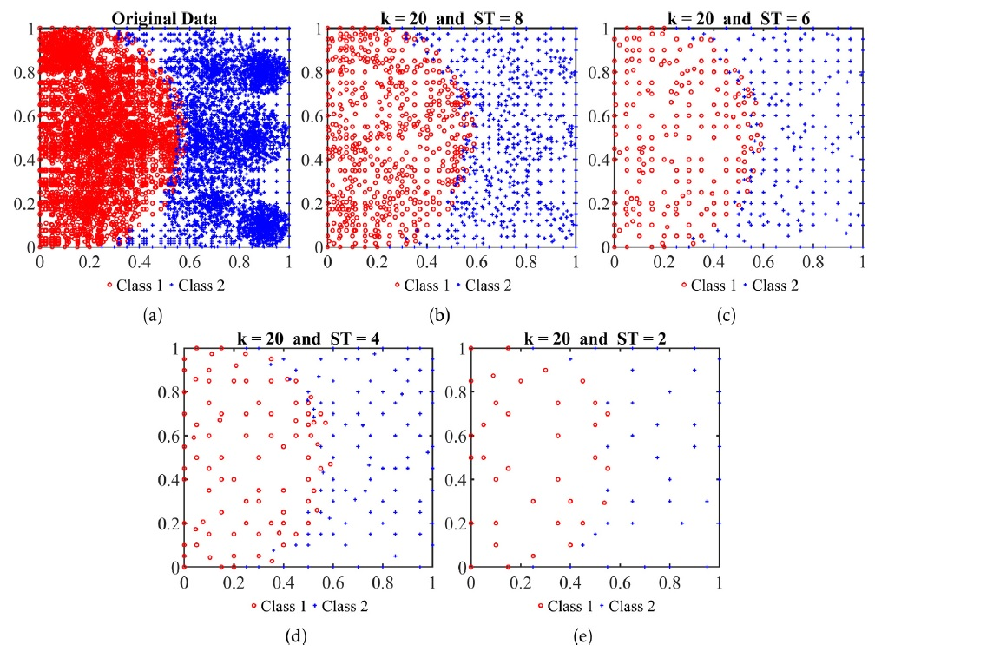

# Images in readme

# DR.LSH
DR.LSH - Data Reduction based on Locality Sensitive Hashing. DR.LSH is a fast instance selection method. Training classifiers, especially Support Vector Machines (SVM) on huge datasets is usually slow due to their high time complexities. 
DR.LSH alleviates this problem by quickly identifying and removing similar samples to a given sample according to a pre-defined similarity threshold.

The remarkable features of the proposed algorithm are:

• Simplicity

• Linear time complexity

• Integer-based calculations

• Satisfactorily preserving the extent of known classes

• Easy control of the preservation rate by adjusting the input parameters.

# Implementation

The implementation is in MATLAB 2019. Significant effort has been taken to make DR.LSH implementation as fast as possible. 

DRLSH_example.m shows some simple examples of using DR.LSH.  

# Citing

If you have used DR.LSH in a scientific publication and wish to cite it, please use: 

Mohammad Aslani, Stefan Seipel, A fast instance selection method for support vector machines in building extraction, Applied Soft Computing, 2020, 106716, ISSN 1568-4946.
https://doi.org/10.1016/j.asoc.2020.106716
